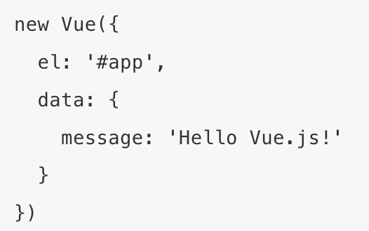
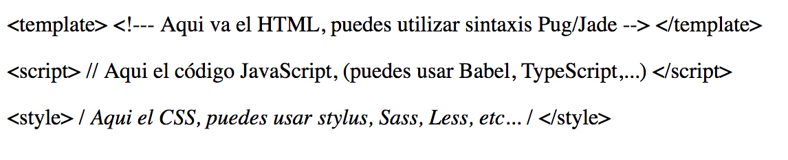

# Características.

### Componentes.

La gran potencia de VueJS proviene del uso de sus componentes. Para su uso, se debe dividir el código en pequeños componentes, que son a menudo reutilizados múltiples veces. La estructura de los componentes del framework utilizan una sintaxis muy similar a la de los ficheros json, como observamos en el siguiente ejemplo:

### Template.
Otra característica importante que posee este framework es el uso de templates. Los templates permites incorporar en un mismo fichero de formato .vue tanto código html como el javascript y el css, pudiendo utilizar sintaxis similar a la usada por jade. Esta característica es muy importante para la composición de grandes proyectos, evitando tener que acceder a múltiples ficheros para cualquier funcionalidad.

  Sintaxis:

Por otro lado, aunque nosotros nos hemos centrado en el lado del servidor, también tiene funcionalidades para ejercer de servidor, manejando las solicitudes y renderizando la dirección deseada.
