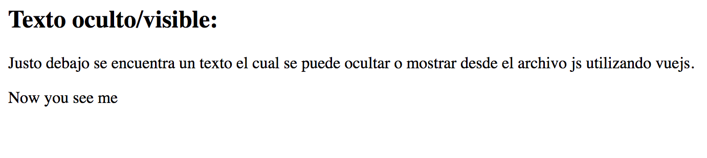

# Mostrar Información

El siguiente apartado abordará los distintas posibilidades que tenemos para mostrar información en el html o ocultarla mediante vue.

### Mostrar Información adicional.

Para comenzar, abordaremos como mostrar un mensaje al poner el cursor encima de un texto determinado. Para ello debemos hacer uso de v-bind:title.
A continuación vemos un ejemplo de su uso.

~~~
<html>
  <head>
  </head>
  <body>
    <h2>Ejemplo pasando el ratón:</h2>
    

      
        Pasando el ratón por encima de este texto y esperando unos segundos,
        aparecerá cuando ha cargado la página.
      
       
      
      Aquí tenemos un mensaje distinto.
      
    

     
  </body>
  
  
</html>
~~~

El mensaje que se desea mostrar irá en el fichero js:

~~~
var app2 = new Vue({
  el: '#app-2',
  data: {
    message: 'Página cargada el ' + new Date().toLocaleString(),
    message2: 'Un mensaje totalmente distinto'
  }
});
~~~

El resultado que obtenemos es el siguiente:

### Editor.

Otras de las opciones que tenemos con vuejs es ir mostrando por pantalla lo que introduzcamos en un cuadro de texto sin necesidad de actualizar la página. Además, todo lo que incluyamos será pasado de formato markdown a html.
Para este tipo de ejercicio, necesitaremos incorporar un paquete para parsear y compilar markdown siendo el marked@0.3.6, y lodash@4.16.0 para trabajar con las cadenas que obtendremos.

~~~
<html>
  <head>
  </head>
  <body>
    <h2>Editor de texto utilizando vuejs:</h2>
    
A continucación podemos encontrar un editor de texto, que saca por pantalla lo que escribimos.

    

      <textarea :value="input" @input="update"></textarea>
      

    

  </body>
  
        

        
  
</html>
~~~

La salida vendrá del div con id salida en formato html.

El código js necesario será:

 ~~~
 new Vue({
   el: '#editor',
   data: {
     input: '# hello'
   },
   computed: {
     compiledMarkdown: function () {
       return marked(this.input, { sanitize: true })
     }
   },
   methods: {
     update: _.debounce(function (e) {
       this.input = e.target.value
     }, 500)
   }
 });
 ~~~

 La función dentro de compiledMarkdown contendrá el valor que se devolverá una vez introducido. Con la función marked() haremos la conversión de texto markdown a html. En caso de no querer compilarlo, devolveremos directamente this.input.
 Con la función debounce en update actualizaremos el valor mostrado por pantalla.

 A continuación se mostrará un ejemplo sin compilar el markdown:

 

 El siguiente ejemplo es con el makdown compilado:

 

 ### Ocultar texto

 Podemos ocultar texto mediante el tipo v-if de vue. Si el valor del atributo es verdadero, se mostrará la variable, en caso de ser falso, no se mostrará.

A continuación tendremos un ejemplo de esta función.

~~~
<h2>Texto oculto/visible:</h2>

Justo debajo se encuentra un texto el cual se puede ocultar o mostrar desde el archivo js utilizando vuejs.

  Now you see me

 
~~~

En este caso, el atributo se llamará seen, aunque se puede cambiar el nombre libremente.

~~~
var app3 = new Vue({
  el: '#app-3',
  data: {
    seen: true
  }
});
~~~
El resultado se puede ver a continuación:
seen = true:

seen = false:

Como vemos, solo se puede modificar el valor mediante el fichero js, pero combinándolo con la funcionalidad anterior podemos indicar que si se desea borrar, se oculte la línea:

